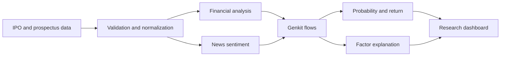

<div align="center">

# IPOP

**An AI-assisted workspace for structured IPO research, probability analysis, and explainable investment review.**

<p>
  
  
  
  
</p>

<p>
  <a href="#overview">Overview</a> ·
  <a href="#capabilities">Capabilities</a> ·
  <a href="#architecture">Architecture</a> ·
  <a href="#getting-started">Setup</a> ·
  <a href="#project-status">Status</a>
</p>

</div>

---

## Overview

IPOP organizes fragmented IPO information into a consistent research workflow. It combines financial inputs, AI-generated analysis, probability estimates, expected-return calculations, news sentiment, and explanation flows in a single authenticated dashboard.

The project is designed as an analytical and educational system. Its scores and generated explanations are decision-support outputs, not investment recommendations.

## Capabilities

| Capability | Description |
|---|---|
| IPO workspace | Lists upcoming offerings and exposes detailed analysis views |
| Prediction workflow | Generates an IPO prediction and probability estimate |
| Expected return | Produces a structured return calculation from analysis inputs |
| Explainability | Describes the factors contributing to a prediction |
| Prospectus processing | Parses prospectus data into a usable analysis structure |
| Sentiment analysis | Summarizes relevant news sentiment |
| Backtesting | Provides an AI flow for running historical evaluation scenarios |
| User platform | Supports Firebase-backed authentication, Firestore data, and Pro account flows |

## Analysis pipeline



## Technology

| Layer | Technologies |
|---|---|
| Application | Next.js 15, React 18, TypeScript |
| Interface | Tailwind CSS, Radix UI, Recharts |
| AI orchestration | Genkit, Google GenAI, Gemini 2.5 Flash |
| Authentication and data | Firebase Authentication, Firestore, Firebase Admin |
| Validation | Zod, React Hook Form |
| Billing workflow | Stripe |

## Repository layout

```text
.
|-- src/app/          Routes, dashboard, analysis, IPO, and account views
|-- src/ai/flows/     Prediction, return, sentiment, parsing, and backtest flows
|-- src/components/   Product and interface components
|-- src/firebase/     Client and Admin SDK integration
|-- src/functions/    Server-side functions and Stripe webhook handling
|-- docs/             Product blueprint and backend reference
`-- apphosting.yaml   Firebase App Hosting configuration
```

## Getting started

### Prerequisites

- Node.js 20 or newer
- npm
- A Firebase project or Application Default Credentials
- Access to a supported Google AI project

### Installation

```bash
git clone https://github.com/codingyash9-bit/IPOP.git
cd IPOP
npm install
```

For local server-side Firebase access, provide Application Default Credentials or define `FIREBASE_SERVICE_ACCOUNT_KEY` as a JSON-encoded service account. Stripe-backed Pro flows additionally require `STRIPE_SECRET_KEY` and `STRIPE_WEBHOOK_SECRET`.

Start the application on port `9002`:

```bash
npm run dev
```

Run Genkit locally in a second terminal when developing AI flows:

```bash
npm run genkit:dev
```

## Available scripts

| Command | Purpose |
|---|---|
| `npm run dev` | Start Next.js with Turbopack on port 9002 |
| `npm run genkit:dev` | Start the Genkit development environment |
| `npm run genkit:watch` | Start Genkit with source watching |
| `npm run build` | Create a production build |
| `npm run typecheck` | Validate TypeScript without emitting files |

## Project status

| Area | State |
|---|---|
| Authenticated dashboard | Implemented |
| IPO analysis flows | Implemented prototype |
| Prospectus parsing | Implemented flow |
| Backtest workflow | Implemented flow |
| Firebase integration | Implemented |
| Stripe integration | Present |
| Verified predictive performance metrics | Not documented |
| Live exchange-data guarantee | Not established |

## Responsible use

IPOP is intended for research and education. AI output can be incomplete, delayed, or incorrect. Validate all financial data against primary filings and exchange disclosures, and consult a qualified financial professional before making investment decisions.

---

<div align="center">
  <sub>Designed and developed by <a href="https://github.com/codingyash9-bit">Yash Mahadeshvar</a>.</sub>
</div>
